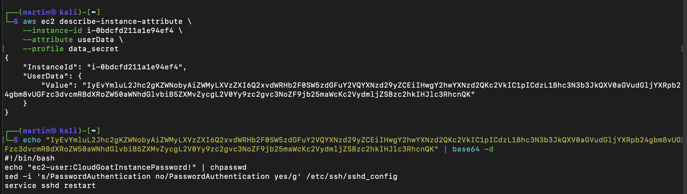
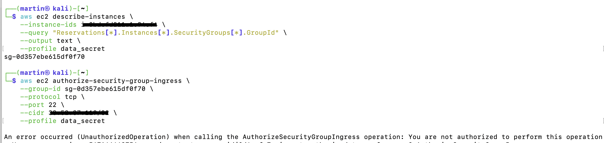
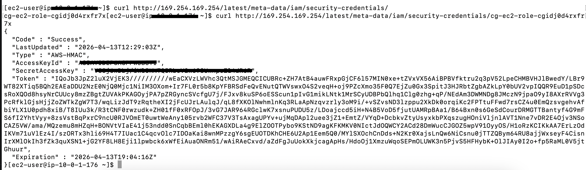
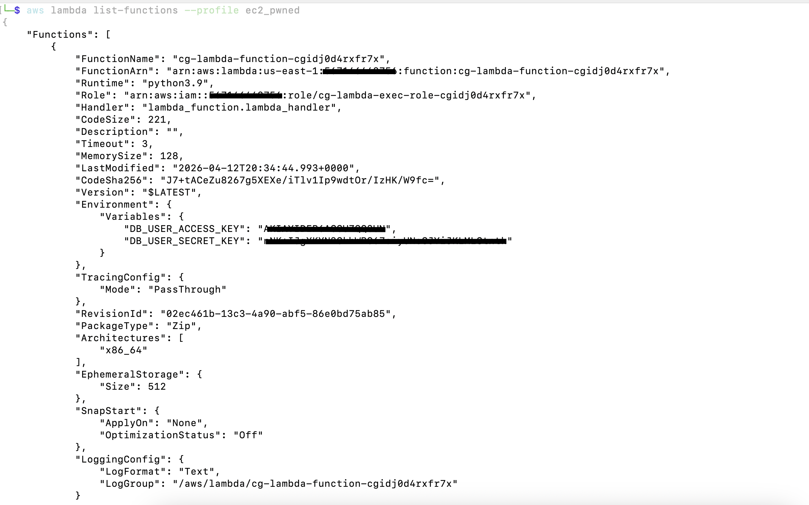
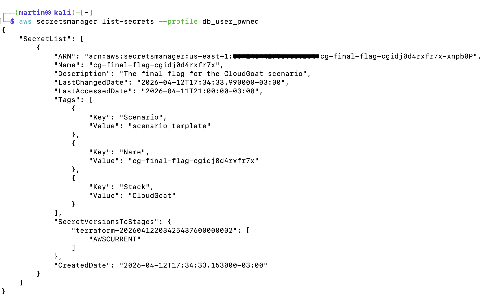
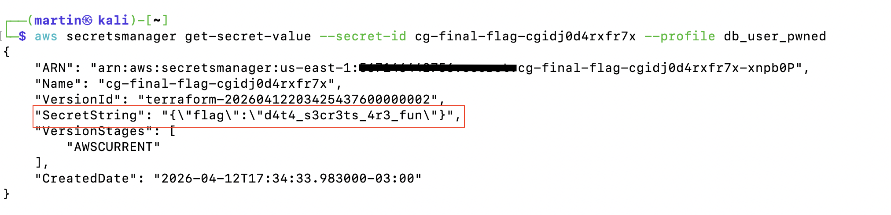

# 🕵️‍♂️ Chronicle of a Compromise: CloudGoat data_secrets
Hey! Here I’m documenting my step-by-step journey through the data_secrets scenario. The idea is to go from basic initial access all the way to extracting sensitive secrets in AWS.

---

## 📋 Starting Point

The data we received at the start of the lab:

Resources: 1 IAM User, 1 EC2 Instance, 1 IAM Role, 1 Lambda Function, and 1 Secret in Secrets Manager.

Starting point: AWS Access Key and Secret Key.

Goal: Retrieve the final "flag" stored in the Secrets Manager.

---

## 🚀 Step 1: First steps and "Whoami?"

First things first: I need to set up the profile to start operating. I used the following command:

```aws configure --profile data_secrets```

Before moving an inch, I had to confirm the credentials actually worked and see exactly which user I was:

```aws sts get-caller-identity --profile data_secrets```

<p align="center">
  " width="700">
</p>

---

## 🔍 Step 2: The IAM Wall (Enumeration)
As any good auditor, the first thing I tried was checking my own permissions. I wanted to list my policies, but... I hit my first wall:

```aws iam list-user-policies --user-name cg-start-user-[ID] --profile data_secrets```
```aws iam list-attached-user-policies --user-name cg-start-user-[ID] --profile data_secrets```

I got a hard AccessDenied. This user has their IAM permissions blocked, which forced me to "poke around the walls" in other services to see what I could find.

Digging for resources

I started throwing commands to see what was alive in the account: S3, Lambda, RDS... but everything failed. Until I tried EC2:

```aws ec2 describe-instances --profile data_secrets --query "Reservations[*].Instances[*].{ID:InstanceId,State:State.Name,PublicIP:PublicIpAddress,Role:IamInstanceProfile.Arn}" --output table```

Found something! There is an EC2 instance running and, most importantly, it has an IAM Role attached. This is my "foothold."

<p align="center">
  
</p>

---

## 🏹 Step 3: Storming the EC2 Instance
I have a public IP, so let's see what ports are open. I used nmap for a quick scan:

<p align="center">
  
</p>

Port 22 (SSH) is open. But how do I get in if I don't have SSH keys? It occurred to me to check the UserData of the instance, which sometimes stores deployment scripts with sensitive info:

```aws ec2 describe-instance-attribute --instance-id [ID] --attribute userData --profile data_secrets```

Awesome! I managed to get a username and password in plain text:

User: ec2-user

Password: CloudGoatInstancePassword!

<p align="center">
  
</p>

---

## ⛓️ Step 4: Escalating inside the instance
Looking for another vector attack, I tried to see if I could modify the Security Groups to open more ports, but the system gave me an AccessDenied again. It seems I can't mess with the network settings.



So the strategy was simple: log in via SSH using the credentials I stole from the UserData. Once inside, my target was the IMDS (Metadata Service) to see if I could "grab" the credentials from the instance's role.

Bash:
```curl http://169.254.169.254/latest/meta-data/iam/security-credentials/cg-ec2-role-[ID]```

<p align="center">
  
</p>

It worked! Now I have fresh temporary keys. I logged out of the instance, configured a new profile on my local machine (ec2_pwned), and continued the attack from my terminal.

## 🔀 Step 5: The missing link (The Lambda)
Now acting as ec2_pwned, I tried going straight for the Secrets Manager, but I got an AccessDenied. I was still missing a link in the chain. I remembered the scenario mentioned a Lambda, so I listed it:

```aws lambda list-functions --profile ec2_pwned```



Bingo! I found a classic leak: credentials for a user named db_user were hardcoded directly into the Lambda's environment variables. This is a very common developer mistake.

---

## 🏁 Step 6: The final blow to the Secrets Manager
I configured my third and final profile: db_user_pwned. This was my last card to reach the secret. I tried listing the secrets and... this time, I got a hit:

```aws secretsmanager list-secrets --profile db_user_pwned```

<p align="center">
  
</p>

Now that I had the secret name, all that was left was to read it:
aws secretsmanager get-secret-value --secret-id [NAME] --profile db_user_pwned

<p align="center">
  
</p>

Mission accomplished! I managed to reach the final flag after jumping through three different identities.

---


## 🧠 Final Thoughts

This lab taught me that cloud security is a chain. No matter how much you lock down IAM, if you leave a password in userData or an Access Key in a Lambda environment variable, an attacker will eventually find the way in.

What did I learn?

Never put passwords in UserData.

Use IMDSv2 to prevent role exfiltration.

Don't store secrets in Lambda environment variables.

---

## 🛡️ Security Analysis & Mitigation Strategies

This scenario is a textbook example of "Security through Obscurity" failing against a structured attack. Below is a breakdown of the misconfigurations found and how to fix them using AWS Best Practices.

### 1. Hardcoded Credentials in UserData
* **The Flaw:** Deployment scripts often contain sensitive information, and any user with `ec2:DescribeInstanceAttribute` permissions can read them in plain text.
* **The Fix:** Never store secrets in UserData. Use **AWS Secrets Manager** or **Systems Manager Parameter Store**. Access these services using **IAM Roles for EC2** so that no credentials ever touch the disk or the metadata attributes.

### 2. Use of IMDSv1 (Instance Metadata Service)
* **The Flaw:** IMDSv1 is session-less, making it vulnerable to SSRF (Server-Side Request Forgery) and simple `curl` commands to exfiltrate IAM role credentials.
* **The Fix:** Enforce **IMDSv2**, which requires a session token (PUT request) to access metadata. You can disable IMDSv1 globally or per instance using:
    ```bash
    aws ec2 modify-instance-metadata-options --instance-id [ID] --http-tokens required
    ```

### 3. Secrets in Lambda Environment Variables
* **The Flaw:** Storing `AWS_ACCESS_KEY_ID` or other secrets in environment variables makes them visible to anyone with `lambda:GetFunction` permissions.
* **The Fix:** * **Option A:** Use **KMS (Key Management Service)** to encrypt environment variables at rest.
    * **Option B (Best):** Do not store credentials at all. Give the Lambda its own **Execution Role** with the specific permissions it needs to perform its task, following the **Principle of Least Privilege (PoLP)**.

### 4. Over-permissive IAM Policies (The Final Blow)
* **The Flaw:** The `db_user` had permissions to read secrets that were not relevant to its role. In AWS, a "db_user" should only have access to specific database secrets, not `Resource: "*"`.
* **The Fix:** Scope down IAM policies using **Resource-level permissions**. Instead of `Resource: "*"`, use the specific ARN of the secret:
    ```json
    "Resource": "arn:aws:secretsmanager:region:account:secret:specific-secret-id"
    ```

### 5. Lack of Monitoring and Guardrails
* **The Flaw:** Throughout the attack, several `AccessDenied` events occurred. In a production environment, these should have triggered an alarm.
* **The Fix:** Enable **AWS CloudTrail** and use **Amazon GuardDuty** to detect anomalous behavior. Implement **Service Control Policies (SCPs)** at the Organization level to prevent users from disabling logging or modifying critical security boundaries.

---


---

## 🛡️ Security Analysis & Mitigation Strategies

This scenario is a textbook example of "Security through Obscurity" failing against a structured attack. Below is a breakdown of the misconfigurations found and the architectural hardening required.

### 1. Weak Network Architecture (Public SSH Exposure)
* **The Flaw:** The instance was placed in a public subnet with port 22 (SSH) open to `0.0.0.0/0`. This is a critical architectural weakness. In my professional experience, I have seen this pattern far too often, and it remains one of the most dangerous entry points for attackers.
* **The Fix:** **Eliminate public SSH access.** Use **AWS Systems Manager (SSM) Session Manager**. This allows you to manage instances without an open inbound port, without a public IP, and without the need for SSH keys, all while logging every command to CloudWatch.

### 2. Hardcoded Credentials in UserData
* **The Flaw:** Any user with `ec2:DescribeInstanceAttribute` permissions can read UserData in plain text.
* **The Fix:** Never store secrets in UserData. Use **AWS Secrets Manager** or **Systems Manager Parameter Store**. Access these services using **IAM Roles for EC2** so that no credentials ever touch the disk or the metadata attributes.

### 3. Use of IMDSv1 (Instance Metadata Service)
* **The Flaw:** IMDSv1 is session-less, making it vulnerable to SSRF and simple `curl` commands to exfiltrate IAM role credentials.
* **The Fix:** Enforce **IMDSv2**, which requires a session-oriented token. You can require this globally or per instance:
    ```bash
    aws ec2 modify-instance-metadata-options --instance-id [ID] --http-tokens required
    ```

### 4. Secrets in Lambda Environment Variables
* **The Flaw:** Storing `AWS_ACCESS_KEY_ID` in environment variables makes them visible to anyone with `lambda:GetFunction` permissions.
* **The Fix:** Do not store static credentials. Grant the Lambda an **Execution Role** with the specific permissions it needs (Principle of Least Privilege).

### 5. Over-permissive IAM Policies
* **The Flaw:** The `db_user` had global read access to Secrets Manager (`Resource: "*"`).
* **The Fix:** Use **Resource-level permissions**. Scope down the policy to the specific ARN of the secret the user needs to access.

---

## 🧠 Final Thoughts

This lab taught me that cloud security is a chain; it is only as strong as its weakest link. However, the biggest takeaway here is the **danger of a weak initial architecture**. 

No matter how much you lock down IAM, if you leave a password in **UserData** or an Access Key in a **Lambda environment variable**, an attacker will eventually find a way in.

### Key Takeaways:
- **Never store passwords in UserData:** Use IAM Roles and Secrets Manager instead.
- **Enforce IMDSv2:** Prevent role exfiltration by requiring session-oriented tokens.
- **Avoid secrets in Lambda variables:** Leverage Execution Roles and KMS encryption.

Throughout my career, I've observed that many organizations still rely on **legacy "on-premise" mindsets**, such as exposing management ports directly to the internet. I am writing this writeup specifically to highlight how a single exposed port, combined with a weak password, can become a gateway to an entire cloud environment. 

**Real security starts at the architectural level:** by reducing the attack surface and removing public entry points, we make the attacker's job significantly harder from the very first step.

---
*Writeup by MartinMarin1*